<p align="center">
  
</p>

```console
$ cat about.txt
```

I'm Saheththiyan, a Computer Science & Engineering undergraduate from Sri Lanka, studying at the University of Moratuwa and specialising in Cyber Security.

I enjoy building systems, from backend applications to low-level and operating system projects. I'm particularly interested in security, system design, and understanding how software behaves under the hood.

```console
$ neofetch
        .-""""-.          saheththiyan@moratuwa
       /  _  _  \         ---------------------
      |  (o)(o)  |        Role     : CSE Undergraduate
      |    __    |        Uni      : University of Moratuwa
       \  \__/  /         Country  : Sri Lanka
     .-'`------'`-.       Focus    : Cyber Security
    /  /|  ||  |\  \      Builds   : Backend, OS, low-level
   (  / |  ||  | \  )     Shell    : bash
    `'  |__||__|  `'      Web      : saheththiyan.me
```

```console
$ ./contributions --skyline
```

<p align="center">
  
</p>

```console
$ ls ~/contact
```

Open to collaborating on interesting projects, open-source contributions, or anything that challenges me to grow.

- [Portfolio](https://saheththiyan.me)
- [LinkedIn](https://www.linkedin.com/in/saheththiyan-sri-baskaran-8286a0260)

```console
$ cat .secret
cat: .secret: Permission denied   # try viewing the source ;)
```

<!--
FLAG{h4h4_g0tchu_n1c3_try_sk1d}
-->
